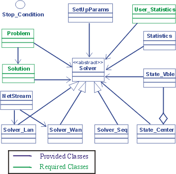

#Proyecto AE
Proyecto para la asignatura Algoritmos Evolutivos (Facultad de Ingeniería, UdelaR) utilizando MALLBA.

---

##Introducción

Mallba es una biblioteca de esqueletos para optimización combinatoria que deben instanciarse con las características de un problema y su solución.     
 
Antes de comenzar cabe destacar que clasificamos a cada una de las clases en una de las siguientes categorías: 
- **Required** (nombre.req.cc): Clase cuyos atributos y métodos definen las características del problema concreto (i.e. Problem, Solution, etc).
- **Provider** (nombre.pro.cc): Clase cuyos atributos y métodos son independiente del problema concreto a resolver en el cual se instanciará, por lo tanto dicha clase será provista por Mallba (i.e. Solver , SetupParams, etc).
- **Interna**: Clase que no tiene significado en si, necesarias para la implementación interna de Mallba pero que no significan ningún concepto desde el punto de vista del algoritmo genético (i.e. NetStream, StateCenter etc).

---

##Descripción del problema
Un espia debe realizar una misión secreta visitando cierta cantidad de ciudades en determinada cantidad de 
días partiendo siempre de la misma ciudad. No debe visitar la misma ciudad dos veces y cada ciudad la visitará 
exatamente cinco días. 

Los costos del viaje entre ciudades están previamente estipulados para temporada baja, ocacionalmente de forma asimétrica (el costo de ida y de vuelta pude variar o puede no existir un viaje bidireccional - valor *-1* en la matriz de costo) y está sujeto a un incremento procentual por temporadas media y alta (10% y 30% respectivamente). Dado que la moneda corriente no acepta fraciones de unidad, el costo resultante se debe redondear al entero más cercano.

El problema consiste en encontrar la ruta más económica para que el espía pueda realizar su misión cumpliendo con todas las restricciones plateadas.

---

##Descripción de la solución
Se plantea la necesidad de contar con un camino que describa la ruta que hará el espía por las ciudades economizando su costo monetario, considerando que el mismo está sujeto a las zafras por temporada y por consiguiente a las estadías en cada ciudad.

De esta forma, la solución será una secuencia de identificadores de ciudades de enteros cuyo índice indicará qué ciudad visitará el espía en determinada ocasión (p.e. para el caso de cinco ciudades, el vector *<4,2,5,3,1>* indica que primero visita la ciudad 4, luego la 2, y así sucesivamente).

La factibilidad de la solución estará dada por ciertas características:
* La primer ciudad deberá ser el origen (identificador 0)
* El camino deberá ser una permitación de identificadores de las ciudades entre 0...cantidad-1
* Para cada par de ciudades <i,j> adyacentes en la ruta el costo(i,j) != -1 

De esta manera, el problema se puede formalizar de la siguiente manera: 

Conociendo

Se busca

---

##Instalación

1) Instalar MPICH

>sudo apt-get install mpich

2) Clonar repositorio

>git clone https://github.com/damiansalvia/ae16pr.git

3) Modificar el archivo *environment*

>\# Malva Configuration 
>Malva\_DIR=<path\_to\_malva> 
>\# MPICH library 
>MPI_BIN=/usr/bin 

4) Compilar libreria
> make all

---

#Recursos
1) Se proveen de dos scripts para *Python 2.7*: 
`generación.py`: Calcula la matriz de costo y temporadas 
`validación.py`: Evalúa la factibilidad de la solución según la matriz de costos y temporadas 
 
2) Se provee un script *bash* para la ejecución completa del algoritmo según los parámetros indicados 

---

##Parametros *.cfg
* **Operadores de seleccion** 
 	0:Random   
	1:Torneo  
	2:Ruleta / Proporcional  
	3:Rank 
	4:Best  
	5:Worst   
* **Operadores de cruzamiento & mutación** 
	0: PMX v1 
	1: Mutacion 
	2: PMX v2 
	3: OX 
	4: CX 
	5: ER 

---

##Ejecución
1) Generar binarios

> make all

2) Ubicarse en el directorio

> cd rep/AE-pr

3) Ejecutar aplicacion

> make SEQ nomb=<nombre_instancia> cant=<cantidad_ciudades> tasa=<tasa_desconectados> 

---
## Usando Eclipse CDT - Problemas comunes

**Parser**  
Eclipse puede presentar errores de sintaxis, pero al compilar por terminal no existen. 
La solución a este problema se describe a continuación: 
1) Ir a "Proyect properties > C/C++ Builds > Settings" 
2) Ubicarse en la solapa "Tool Settings" y buscar "GCC C++ Compiler" 
3) Debería versee 
:Compiler: gcc 
:All options: _-std=g++1x_ -I/<path>/src -O3 -g3 -Wall -c -fmessage-length=0 
 Para ver _-std=gnu++1x_ se debe escribir en "Dialect" en el _other dialect flags_   

**Makefile** 
Para compilar con tu propio makefile hay que seguir estos pasos: 
1) Ir a "Proyect properties > C/C++ Builds" 
2) Deshabilitar la opción "Generate Makefiles Automatically" y fijarse que el "Build location" sea el path a donde se encuentra el makefile principal. 
3) Abrir la vista "Make target" 
4) Con la opción "Botón Derecho > Make target" se puede ejecutar el makefile

